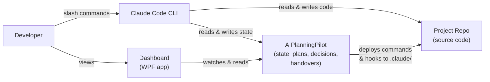
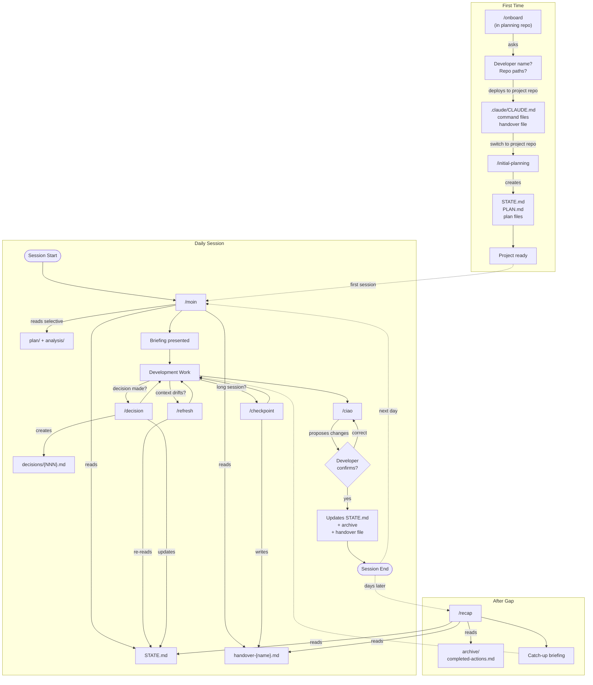
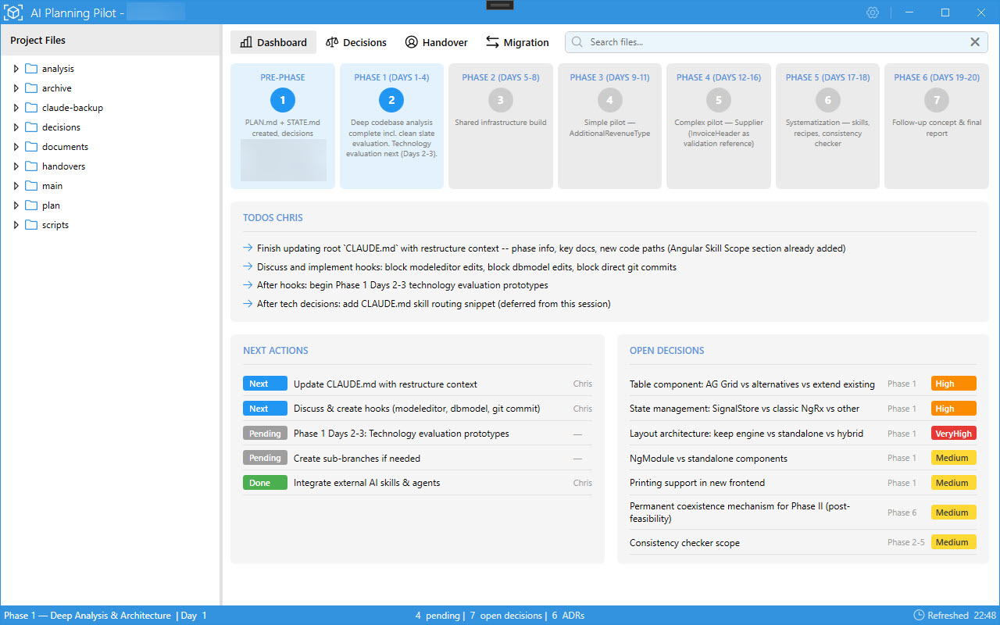
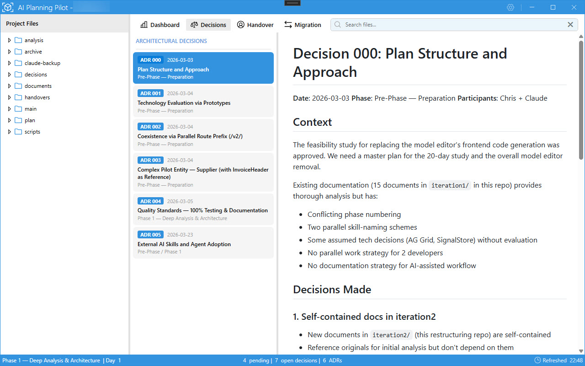
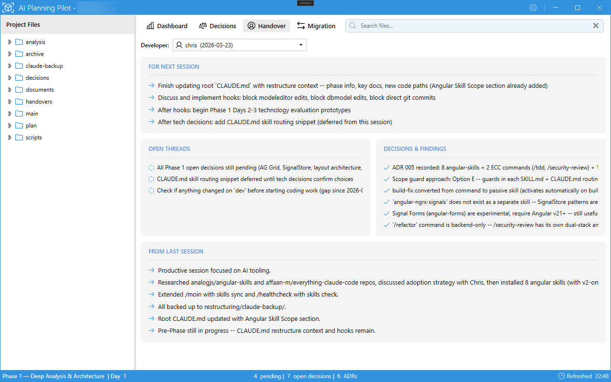
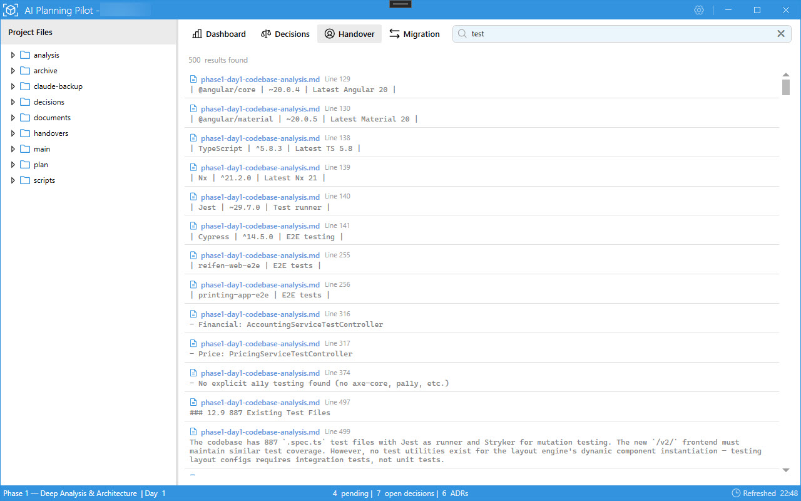
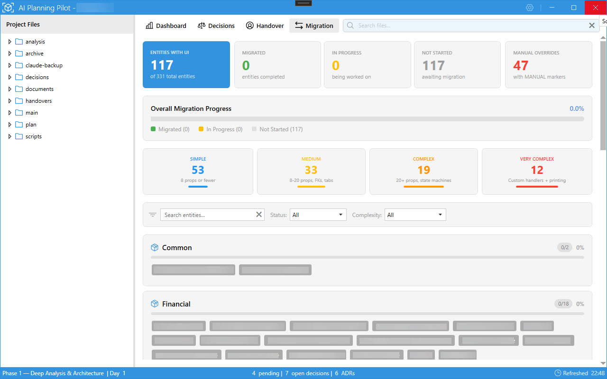

# AI Planning Pilot

A file-based project management framework for [Claude Code](https://docs.anthropic.com/en/docs/claude-code) sessions.
Manages context, state, and decisions across sessions so each new conversation picks up where the last one left off.

Claude Code sessions are stateless - every new conversation starts from scratch.
On real projects you lose track of what was decided, what's in progress, and what to do next.
This framework fixes that with a persistent state layer built on plain Markdown files.

**Use it when:**

- Your project spans multiple sessions or days
- You need structured progress tracking without heavyweight tools
- Design decisions need to be recorded with context and rationale (ADRs)
- Multiple developers share a codebase and need independent handover notes



---

## Getting Started

### Prerequisites

- [Claude Code](https://docs.anthropic.com/en/docs/claude-code) CLI installed
- Node.js on PATH (required by hook scripts)
- Git Bash (on Windows)

### Setup

You need two repositories: one for your project's source code, one for planning.

```
MyProject/              <- your source code (existing or new)
MyProject-planning/     <- clone of this repo
```

Clone this repo as your planning repo. The planning framework content is in the
`AIPlanningPilot/` subfolder - set `${PLANNING_REPO}` to point there.

**Step 1** - Open Claude Code **in the planning repo** and run `/onboard`.
The wizard configures paths, identity, deploys commands and hooks to your project repo's `.claude/`, and creates your personal handover file.

**Step 2** - Open Claude Code **in your project repo** and run `/initial-planning`.
The wizard helps you define phases, then generates `STATE.md`, `PLAN.md`, plan files, and `decisions/INDEX.md`.

**Step 3** - From now on, every session starts with `/moin` and ends with `/ciao`.

```
/moin                   Start of session - loads state, presents briefing
  ... work ...
  /decision             Record a decision (anytime)
  /checkpoint           Save mid-session progress (optional)
  /refresh              Re-anchor context if session runs long (optional)
  ... work ...
/ciao                   End of session - updates state, writes handover
```

```
(planning repo)  /onboard  ->  (project repo)  /initial-planning -> /moin -> work -> /ciao
                                                        ^                |
                                                        +----------------+
                                                           (next session)
```

---

## How It Works

The framework manages context across Claude Code sessions using a file-based state machine.
Each session reads state, works on tasks, and writes state back.



### Key Concepts

**STATE.md** is the single source of truth for current project state. Every session reads it first. Historical data lives in `archive/`.

**Handover files** are per-developer. Each developer owns their file exclusively - no merge conflicts, no coordination needed.

**Selective context loading**: `/moin` loads only the current phase and relevant files, keeping Claude's context window lean (~20 KB) instead of dumping everything at once.

**Two-repo model**: Your source code lives in the project repo; plans, state, and decisions live here in the planning repo. The `claude-backup/` directory is the developer-agnostic template - `/onboard` and `/moin` deploy it to `.claude/`, replacing path variables with literal paths. See [CONFIG.md](AIPlanningPilot/main/CONFIG.md) for details.

### Commands

| Command | When | What it does |
|---------|------|-------------|
| `/onboard` | First session ever | Setup wizard - configures paths, identity, creates handover file |
| `/initial-planning` | After onboarding | Interactive wizard - creates project plan, phases, STATE.md |
| `/moin` | Start of each day | Loads state, presents briefing, shows handover notes |
| `/refresh` | Mid-session | Lightweight context re-anchor |
| `/decision` | When a decision is made | Records ADR immediately, updates STATE.md |
| `/checkpoint` | Long sessions | Saves progress to handover file without ending session |
| `/ciao` | End of day | Proposes state updates, writes after confirmation |
| `/recap` | Returning after days off | Broader catch-up with completed actions and new decisions |
| `/healthcheck` | Something feels off | Runs 13 environment checks, reports PASS/WARN/FAIL with fixes |
| `/refactor` | Code quality review | Analyzes SOLID, clean code, test coverage; generates refactoring plan |
| `/subtree-pull` | Framework update | Pulls latest AIPlanningPilot changes from source repo into subtree |
| `/subtree-push` | Framework contribution | Pushes shared framework changes back to the AIPlanningPilot source repo |

---

## Dashboard

The planning framework is text-based by design - Claude reads and writes Markdown files.
But for humans, scanning a dozen `.md` files to get the full picture is tedious.
The Dashboard is a WPF desktop application that gives you a visual overview of your project's planning state in real time.

### Features

- **Project overview** - phase timeline with progress indicators, next actions, open decisions, and per-developer todos at a glance
- **Decision browser** - lists all Architecture Decision Records (ADRs) with rendered Markdown detail view
- **Handover viewer** - shows per-developer handover notes: next-session items, open threads, decisions & findings, and last-session summary
- **Full-text search** - searches across all planning documents with file name, line number, and context
- **Migration tracker** - KPI cards, progress bars, complexity breakdown, and per-module entity status for large migrations
- **Live updates** - watches the planning repo for file changes and refreshes automatically

### Screenshots











---

## Solution Structure

```
AIPlanningPilot/                      (repo root)
+-- AIPlanningPilot.slnx              Solution file (3 projects)
+-- NuGet.Config                      NuGet package sources
+-- Readme.md                         This file
+-- LICENSE                           MIT License
|
+-- AIPlanningPilot/                  Planning framework (NoTargets project)
|   +-- main/                         Core orchestration (STATE.md, PLAN.md, CONFIG.md)
|   +-- plan/                         Phase-specific plan files
|   +-- decisions/                    Architecture Decision Records
|   +-- handovers/                    Per-developer handover files
|   +-- analysis/                     Codebase analysis documents
|   +-- archive/                      Historical data and backups
|   +-- claude-backup/                Template source of truth for .claude/
|   +-- tests/                        Hook validation tests (bash)
|
+-- AIPlanningPilot.Dashboard/        WPF desktop dashboard (MahApps.Metro)
|   +-- Services/                     Parsers and business logic
|   +-- ViewModels/                   MVVM view models (CommunityToolkit.Mvvm)
|   +-- Views/                        XAML views
|   +-- Models/                       Domain models
|
+-- AIPlanningPilot.Dashboard.Tests/  Unit tests (NUnit + FluentAssertions + Moq)
```

### Building

```bash
dotnet build AIPlanningPilot.slnx       # Build the entire solution
dotnet test AIPlanningPilot.slnx        # Run tests
dotnet run --project AIPlanningPilot.Dashboard/AIPlanningPilot.Dashboard.csproj  # Run Dashboard
```

**Prerequisites:** .NET 8.0 SDK, Windows (WPF requires Windows)

### Testing

**Hook tests (bash):**

```bash
cd AIPlanningPilot/tests/hooks
bash run-tests.sh                    # Run all tests
bash run-tests.sh validate-state     # Run only matching test files
```

Tests use temp directories with isolated `env.sh` - they don't touch real repo files.

**Dashboard tests (.NET):** `dotnet test AIPlanningPilot.slnx`
